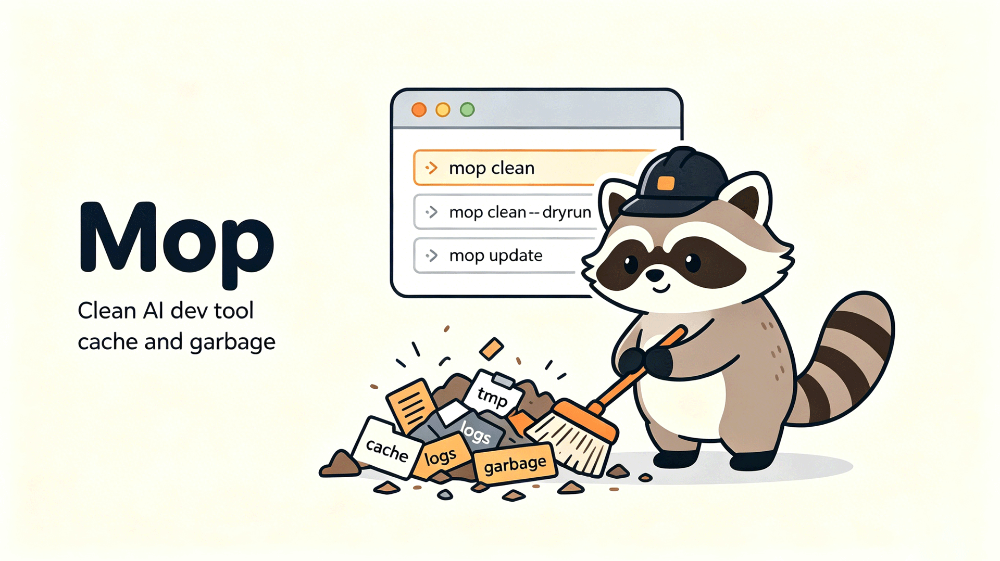

# mop

<p align="center">
  
</p>

[中文文档](README_ZH.md) | English

AI coding tools leave gigabytes of cache, sessions, and credentials scattered across your disk — and they don't clean up after you uninstall them. mop finds and safely clears all of it in one TUI.

## Features

- Fast startup: single binary <10MB, launches in <50ms
- TUI interface built with Bubble Tea
- Safe deletion: moves to Trash by default, recoverable anytime
- Time filter: all / 3 days / 7 days / 30 days
- Large file highlight: items >100MB are auto-highlighted
- Whitelist: press W to quickly add/remove paths
- Configurable: enable/disable scanners per tool
- Script-friendly: non-interactive mode (`mop clean`)

## Install

### Quick Install (Recommended)

**Apple Silicon (M1/M2/M3/M4)**

```bash
curl -L https://github.com/Do-ooo/mop/releases/latest/download/mop-darwin-arm64 -o mop && chmod +x mop && sudo mv mop /usr/local/bin/
```

**Intel Mac**

```bash
curl -L https://github.com/Do-ooo/mop/releases/latest/download/mop-darwin-amd64 -o mop && chmod +x mop && sudo mv mop /usr/local/bin/
```

Then run:
```bash
mop
```

### Build from Source

```bash
git clone https://github.com/Do-ooo/mop.git
cd mop
go build -o mop .
```

## Usage

### Interactive Mode (Default)

```bash
mop
```

Main menu options:
- **Analyze** — Regular mode, scans safe items (cache/logs/temp files)
- **Deep Analyze** — Deep mode, scans all items (including session history, unrecoverable)
- **Manage Tools** — Enable/disable scanners per tool
- **About** — About mop

### Keyboard Shortcuts (Selection Screen)

| Key | Action |
|-----|--------|
| `↑/↓` or `j/k` | Navigate |
| `Space` | Toggle selection |
| `a` | Select all |
| `i` | Invert selection |
| `w` | Add/remove from whitelist |
| `r` | Rescan |
| `t` | Cycle time filter (all → 3d → 7d → 30d) |
| `d` | Toggle delete mode (Trash/Delete) |
| `Enter` | Start cleaning (Deep mode requires confirmation) |
| `q` | Back to menu / Quit |

### CLI Mode

#### Scan (preview only)

```bash
mop scan
```

#### One-shot Clean

```bash
# Move to Trash (default)
mop clean

# Preview without deleting
mop --dry-run

# Permanently delete (skip Trash)
mop clean --delete
```

#### Self-Update

```bash
mop update
```

Checks for the latest release and updates the binary in place.

### Supported Tools

| Tool | Type |
|------|------|
| Trae | CLI + Desktop |
| WorkBuddy | CLI + Desktop |
| Cursor | Desktop |
| Windsurf | Desktop |
| VS Code | Desktop |
| Codex | CLI + Desktop |
| Claude Code | CLI |
| CodeBuddy | CLI + Desktop |
| Qoder | CLI + Desktop |
| OpenCode | CLI |
| Continue | CLI |
| Gemini | CLI + Desktop |
| Aider | CLI |
| Copilot | CLI |
| Codeium | CLI |
| JetBrains | Desktop |
| Augment | CLI |
| Supermaven | CLI |
| GitHub CLI | CLI |
| MiMo Code | CLI |

## Configuration

Config files are stored in `~/.config/mop/`:

- `config.json` — Global config (delete mode, etc.)
- `whitelist.json` — Whitelisted paths
- `enabled_scanners.json` — Enabled scanners

## Architecture

```
main.go          # Entry point, subcommand dispatch
scanner/         # Scanners, one file per tool
cleaner/         # Cleaners (file deletion / Trash)
tui/             # TUI interface
config/          # Config management
whitelist/       # Whitelist management
update/          # Self-update logic
```
